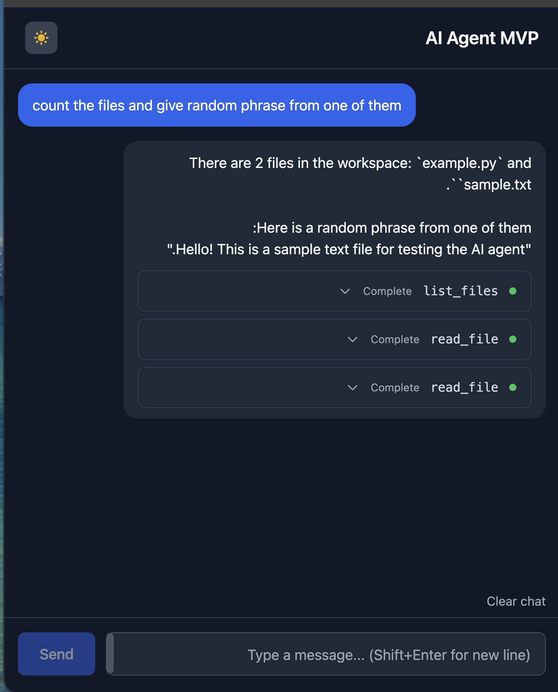

# AI Agent MVP

An AI agent that makes autonomous decisions to complete tasks. Give it a goal, and it figures out what tools to use, executes them, and keeps going until the job is done. Built with FastAPI + React.



## Quick Start

You'll need Python 3.11+, Node.js 18+, and an OpenAI API key.

```bash
./run.sh
```

That's it. The script handles venv, dependencies, and starts both servers.

Open http://localhost:3000 when it's ready.

## Manual Setup

If you prefer doing things yourself:

```bash
# Backend
cd backend
python -m venv .venv && source .venv/bin/activate
pip install -e .
cp .env.example .env  # add your OPENAI_API_KEY
uvicorn main:app --reload --port 8002

# Frontend (new terminal)
cd frontend
npm install
npm run dev
```

## How It Works

```
Frontend (React) <--SSE stream-- Backend (FastAPI) --> OpenAI API
```

You chat with the agent, it streams responses back. When it needs to do something (read a file, search, etc.), it calls tools and keeps going until the task is done.

## Tools

The agent can:
- `read_file` - read file contents
- `write_file` - create/overwrite files
- `edit_file` - find & replace in files
- `list_files` - glob for files
- `search_files` - grep through files

All file ops are sandboxed to `workspace/`.

## Project Structure

```
backend/
  main.py      - FastAPI endpoints
  agent.py     - the agent loop
  tools.py     - tool implementations
frontend/
  src/hooks/   - SSE streaming hook
  src/components/
workspace/     - sandboxed file area
logs/          - debug logs (gitignored)
```

## Logs

Logs go to `logs/` - useful for debugging:

```bash
tail -f logs/sse.log      # see all SSE events
tail -f logs/network.log  # see OpenAI API calls
```

## Tutorial

Check `tutorial/` for detailed docs on each part.

## License

MIT
